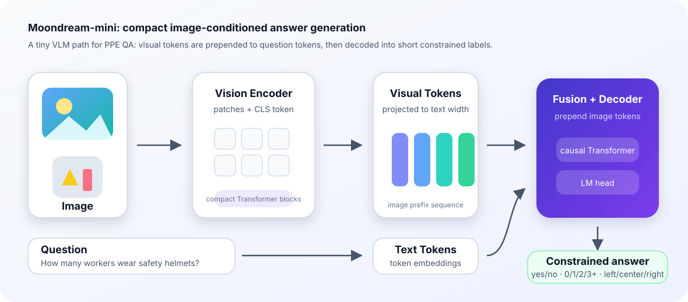
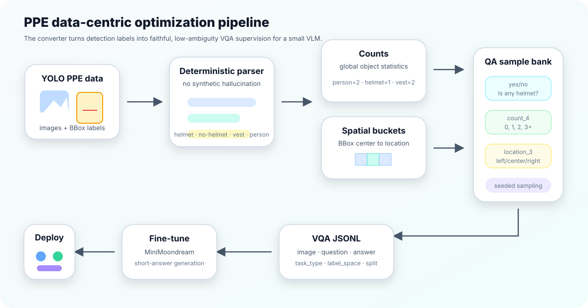
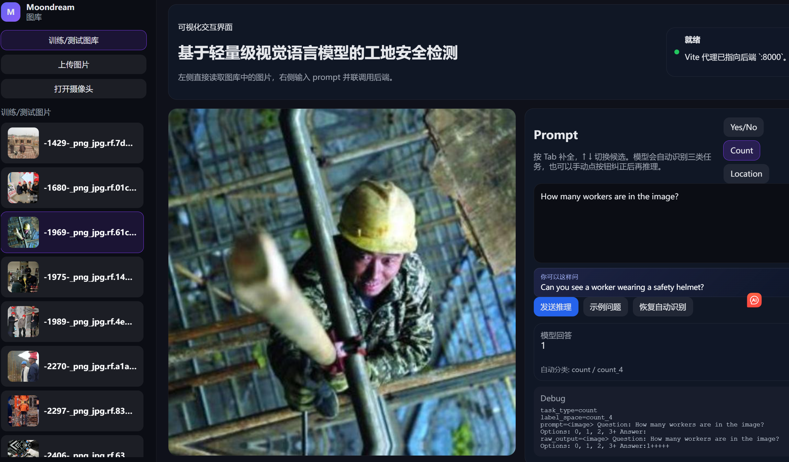

# Moondream Mini PPE

Moondream Mini PPE is a small, task-focused vision-language model built for construction-site PPE visual question answering. It keeps the Moondream-style idea of image-conditioned language generation, but uses a deliberately compact PyTorch architecture and a PPE-specific dataset conversion strategy so it can be trained and deployed locally on modest hardware.

This repository packages three parts into one open-source project:

- the custom `MiniMoondream` model (`src/moondream_mini/model.py`)
- a PPE-optimized YOLO-to-VQA converter (`scripts/convert_ppe_yolo.py`)
- training and inference scripts for constrained-answer PPE QA
- a FastAPI backend and React/Vite web demo (`apps/api`, `apps/web`)

The project is optimized around construction-site safety questions with fixed answer spaces:

- `yes_no`: `yes`, `no`
- `count_4`: `0`, `1`, `2`, `3+`
- `location_3`: `left`, `center`, `right`

This constrained formulation is intentional: instead of asking a tiny model to generate long free-form descriptions, the dataset and prompts turn PPE recognition into short, stable visual QA tasks that are easier to train, evaluate, and deploy.

## Contributions

This project is more than a web demo around an existing VLM. The main contributions are:

- **Moondream-mini**: a compact Moondream-style VLM implemented in PyTorch for low-cost local fine-tuning and inference.
- **Data-centric PPE adaptation**: a deterministic converter that turns YOLO bounding boxes into faithful VLM question-answer supervision.
- **Small-model task design**: constrained answer spaces and explicit prompt options reduce output ambiguity for a lightweight decoder.
- **Spatial discretization**: continuous object centers are mapped into human-readable location labels instead of asking the model to regress coordinates.
- **End-to-end system**: dataset conversion, training, CLI inference, FastAPI serving, and a React web interface are packaged together.

## Moondream-mini Model

The core model lives in [`src/moondream_mini/model.py`](src/moondream_mini/model.py). It is a lightweight reimplementation inspired by Moondream-style VLMs, not a copy of the full upstream model.



Default mini configuration:

| Component | Default |
| --- | --- |
| Image size | `224` during training examples, configurable |
| Patch size | `16` |
| Vision width | `128` |
| Text width | `128` |
| Attention heads | `4` |
| Vision layers | `2` |
| Text layers | `3` |
| Feed-forward width | `384` |
| Fusion method | prepend image tokens before text tokens |

The model has three main parts:

- `VisionEncoder`: patch embedding, CLS token, positional interpolation, and compact Transformer blocks
- `MiniMoondream`: text token embeddings, image/text token type embeddings, causal decoder blocks, and LM head
- `generate`: short-answer autoregressive decoding with repetition control for stable label generation

## PPE-Specific Optimization

This repository is not only a generic mini VLM wrapper. The data and training path are adapted for PPE detection datasets:

- Converts YOLO boxes into natural-language QA pairs, so detection annotations can train a VLM-style interface.
- Uses small label spaces (`yes_no`, `count_4`, `location_3`) to reduce ambiguity and improve exact-match evaluation.
- Buckets object positions into left/center/right answers, which is more robust for small models than precise coordinate generation.
- Caps count answers at `3+`, avoiding brittle long-tail count classes.
- Samples multiple task types per image, mixing existence, counting, and coarse localization from the same annotation file.
- Uses prompt templates with explicit answer options, aligning training, CLI inference, API inference, and web demo behavior.



## Dataset Sources

The PPE VQA data used by this project is converted from public object-detection datasets:

- [Construction Safety Dataset on Roboflow Universe](https://universe.roboflow.com/roboflow-100/construction-safety-gsnvb)
- [Personal Protective Equipment (PPE) Dataset on Kaggle](https://www.kaggle.com/datasets/ndomalau/personal-protective-equipment-ppe-dataset)

The repository does not redistribute these datasets. Download them from the original sources, check their licenses and terms, then run the converter locally.

## Evaluation Results

In the original project report, a fine-tuned Moondream-mini checkpoint was evaluated on a held-out PPE test set of 1,488 VQA samples:

| Model | Task | Samples | Correct | Accuracy |
| --- | --- | ---: | ---: | ---: |
| Fine-tuned Moondream-mini | Total | 1,488 | 1,073 | 72.11% |
| Fine-tuned Moondream-mini | Count | 679 | 421 | 62.00% |
| Fine-tuned Moondream-mini | Location | 162 | 102 | 62.96% |
| Fine-tuned Moondream-mini | Yes/No | 647 | 550 | 85.01% |
| Base Moondream | Total | 1,488 | 1,221 | 82.06% |
| Base Moondream | Count | 679 | 512 | 75.41% |
| Base Moondream | Location | 162 | 117 | 72.22% |
| Base Moondream | Yes/No | 647 | 592 | 91.50% |

The base Moondream model is stronger, as expected from a larger general-purpose VLM. The fine-tuned Moondream-mini result shows the tradeoff explored by this project: a much smaller, locally trainable model can still reach useful PPE QA performance, especially on the safety-critical yes/no compliance task. Count and coarse-location tasks remain harder for the mini model, but the constrained label design makes the gap measurable and gives a clear path for future improvements.

## Project Layout

```text
.
├── apps/
│   ├── api/                 # FastAPI inference service
│   └── web/                 # React/Vite visual demo
├── configs/                 # Training/model config examples
├── docs/                    # Architecture, dataset, model card, and release notes
├── scripts/
│   ├── convert_ppe_yolo.py  # YOLO PPE dataset to JSONL VQA
│   ├── train.py             # Mini VLM training entrypoint
│   ├── infer.py             # CLI inference
│   └── evaluate.py          # Test-set evaluation
└── src/moondream_mini/      # Reusable Python package
```

More details:

- [Model card](docs/model_card.md)
- [Architecture notes](docs/architecture.md)
- [Dataset conversion notes](docs/dataset.md)
- [Local Mac runbook](docs/local_run_mac.md)

## Install

```bash
python -m venv .venv
source .venv/bin/activate
pip install -e ".[dev]"
```

Install the frontend separately:

```bash
cd apps/web
npm install
```

## Prepare PPE Data

Expected input is one or more YOLO dataset roots under a parent directory:

```text
/path/to/ppe-yolo/
└── dataset-a/
    ├── data.yaml
    ├── train/images
    ├── train/labels
    ├── valid/images
    └── valid/labels
```

Convert it to VQA JSONL:

```bash
python scripts/convert_ppe_yolo.py \
  --data-dir /path/to/ppe-yolo \
  --output-dir data/moondream_ppe_vqa \
  --copy-images \
  --samples-per-image 3
```

## Train

Place or generate a tokenizer at `artifacts/tokenizer/tokenizer.json`, then run:

```bash
python scripts/train.py \
  --train-jsonl data/moondream_ppe_vqa/train.jsonl \
  --val-jsonl data/moondream_ppe_vqa/val.jsonl \
  --image-root data/moondream_ppe_vqa \
  --tokenizer artifacts/tokenizer \
  --output-dir checkpoints/moondream-mini \
  --epochs 20 \
  --batch-size 16 \
  --image-size 224
```

## CLI Inference

```bash
python scripts/infer.py \
  --image data/moondream_ppe_vqa/images/val/example.jpg \
  --question "How many workers wear safety helmets?" \
  --tokenizer artifacts/tokenizer \
  --checkpoint checkpoints/moondream-mini/moondream_mini_best.pt
```

## Evaluate

```bash
python scripts/evaluate.py \
  --test-jsonl data/moondream_ppe_vqa/test.jsonl \
  --image-root data/moondream_ppe_vqa \
  --tokenizer artifacts/tokenizer \
  --checkpoint checkpoints/moondream-mini/moondream_mini_best.pt
```

## API and Web Demo

Create `.env` from `.env.example`, then point it at your local checkpoint and tokenizer:

```bash
cp .env.example .env
```

Edit `.env` if your checkpoint path is different, then start both backend and frontend:

```bash
./run_demo.sh
```

Open `http://localhost:5173`.



Manual startup is also supported:

```bash
export MOONDREAM_CHECKPOINT=checkpoints/moondream-mini/moondream_mini_best.pt
export MOONDREAM_TOKENIZER=artifacts/tokenizer
export MOONDREAM_DATA_ROOT=data/moondream_ppe_vqa
uvicorn apps.api.app:app --host 127.0.0.1 --port 8000
```

In another terminal:

```bash
cd apps/web
npm run dev
```

## What Is Not Committed

The repository intentionally excludes:

- raw datasets
- generated JSONL/image copies under `data/`
- checkpoints and model weights
- tokenizer artifacts
- local logs, notebooks, cache files, and `.env`

For GitHub releases, publish weights separately through GitHub Releases, Hugging Face, or another artifact host.

## License

Apache-2.0. Check upstream model and dataset licenses before publishing derived weights or bundled sample data.
